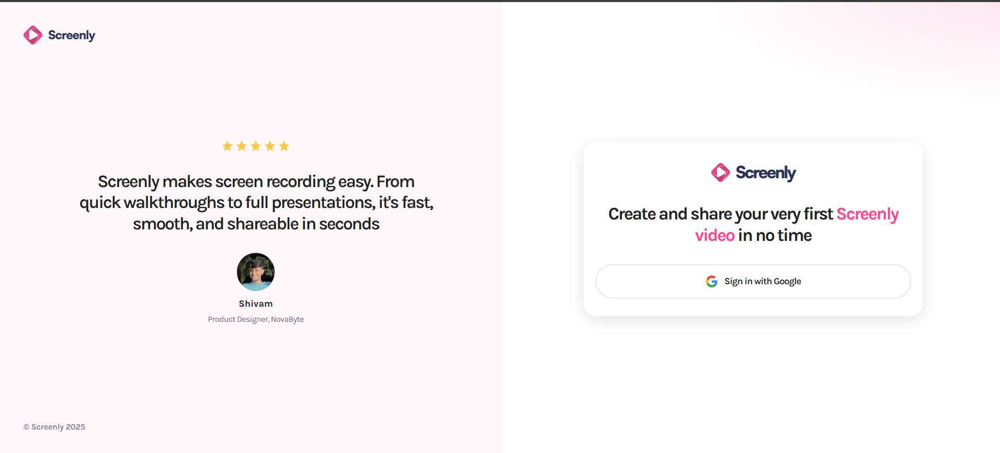
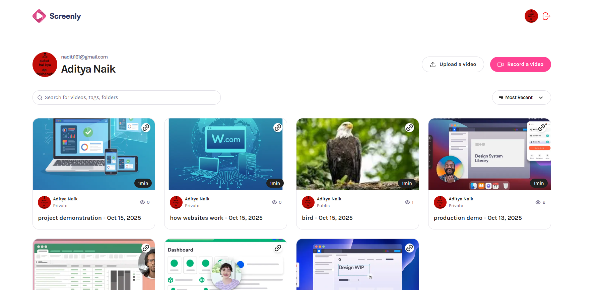

# Screenly

**Screenly** is a modern web application inspired by [Loom](https://www.loom.com/). It allows users to **record their screen, upload, and share recordings instantly** with others.  

**Live Demo:** [screenly-pink.vercel.app](https://screenly-pink.vercel.app)

---

## Features

- **Screen Recording** — Capture your screen with a single click.  
- **Upload & Share** — Record, upload, and share videos with high-quality streaming and captions.

- **Video Transcripts & Captions** — Get automatic transcripts and captions for your recordings.
- **User Authentication** — Secure login and account management.  
- **Responsive Design** — Fully responsive and mobile-friendly layout.
- **Rate limiting & security** — Protected with Arcjet for rate limiting, shield, and bot protection.

---

## Tech Stack

**Frontend:** React.js 19, Next.js 15.5.5  
**Styling:** Tailwind CSS 4  
**Database:** PostgreSQL, Zata, Drizzle ORM  
**Authentication:** Better-Auth  
**Type safty:** TypeScript  
**Storage:** Bunny.net (for video & thumbnail hosting)  
**Security:** Arcjet (rate limiting, shield, bot protection)  
**Deployment:** Vercel  

---

## Project Structure
```bash
├── app/           # Next.js app directory
│ ├── (auth)/      # Contains authentication pages and logic
│ ├── (root)/      # Main app layout
│ └── api/         # API routes for server-side logic
├── components/    # Reusable React components used across different pages
├── lib/
│ ├── action/      # server actions, like database queries or API calls
│ └── hooks/       # Custom React hooks
├── public/        # Static assets
└── drizzle/       # Database schema and configuration using Drizzle ORM
```

## Challenges Faced

- Encountered a **middleware size limit (1MB)** due to combining `Arcjet` and `Better-Auth` libraries.  
- Optimized imports and configurations to ensure smooth deployment on Vercel.  
- Managed type errors and API integration challenges while learning **TypeScript** and **Next.js** together.  

---

## Screenshots

### Login Page



### Home page


### Video Upload form

 


### Video Details Page

 

### Profile Page


---

##  What I Learned

- Deep understanding of **Next.js app router** and **server-side rendering**.  
- Implementing **Better-Auth** for secure authentication.  
- Working with **PostgreSQL** and **Drizzle ORM** for structured database design.  
- Creating **custom React hooks** for reusable logic.  
- Debugging and deploying a production-grade app with **Vercel**.  

---

##  Getting Started

To run this project locally, follow these steps:

1. **Clone the repository:**

    ```bash
    git clone https://github.com/YourUsername/Screenly.git
    ```
2. **Install dependencies:**

    ```bash
    npm i
    ```
3. **Create a .env file in the root directory and add your environment variables:**

4. **Run the development server:**
    ```bash
    npm run dev
    ```

5. **Open http://localhost:3000 in your browser to see the app.**

## 📝 License

 [MIT License](LICENSE) 
